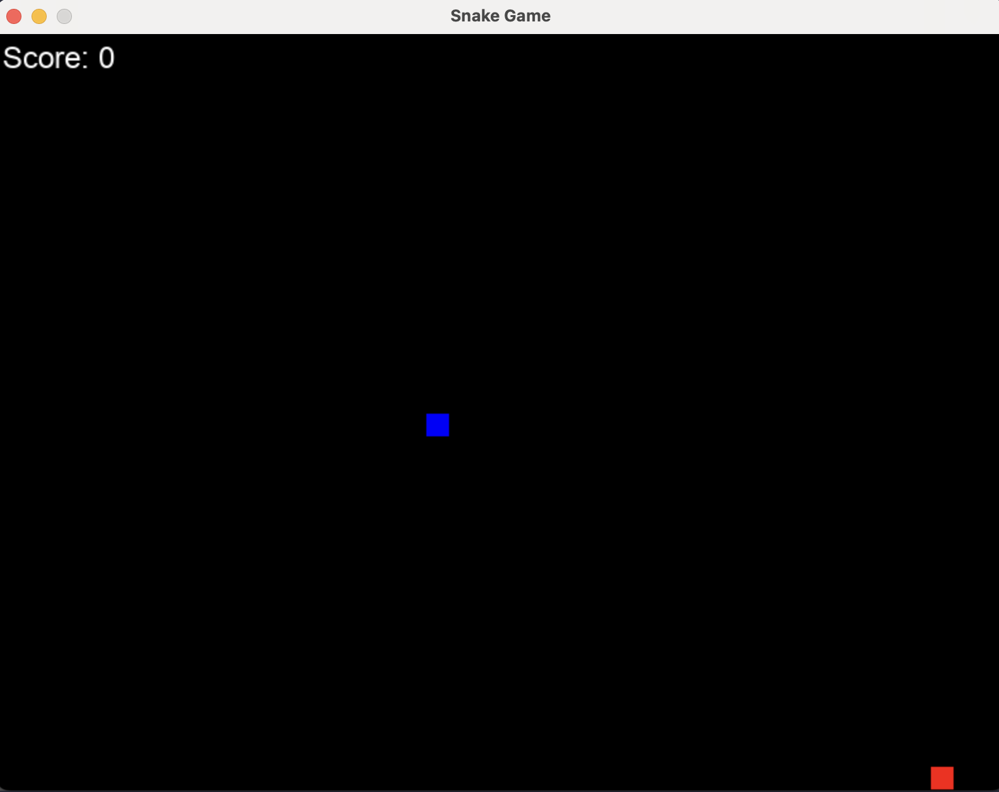

# Snake Game

A classic implementation of the Snake game built with Python and Pygame. 

 <!-- You may want to create a screenshots folder and add a game screenshot -->

## Description

Snake Game is a simple yet entertaining implementation of the classic arcade game where you control a snake that grows as it eats food. Avoid colliding with walls and yourself as you try to achieve the highest score possible!

## Features

- Smooth snake movement
- Score tracking
- Game over screen with restart option
- Simple and clean interface

## Requirements

- Python 3.x
- Pygame library

## Installation

1. Clone this repository:
```bash
git clone https://github.com/yourusername/snake_game.git
cd snake_game
```

2. Install the required dependencies:
```bash
pip install pygame
```

## How to Play

1. Run the game:
```bash
python main.py
```

2. Use the arrow keys or WASD to control the snake's direction.
3. Eat the red food to grow and increase your score.
4. Avoid colliding with yourself or the game will end.
5. When game over, press 'R' to restart.

## Controls

- Arrow Keys or WASD: Change snake direction
- R: Restart the game after game over

## Code Structure

The game is organized into three main classes:

- `Snake`: Manages the snake's body segments, movement, and behavior
- `Food`: Handles food spawning and collision detection
- `Game`: Controls the main game logic, rendering, and user input

## Future Improvements

- Add difficulty levels
- Implement a high score system
- Add sound effects
- Create different game modes
- Implement increasing speed

## License

This project is licensed under the MIT License - see the LICENSE file for details.
